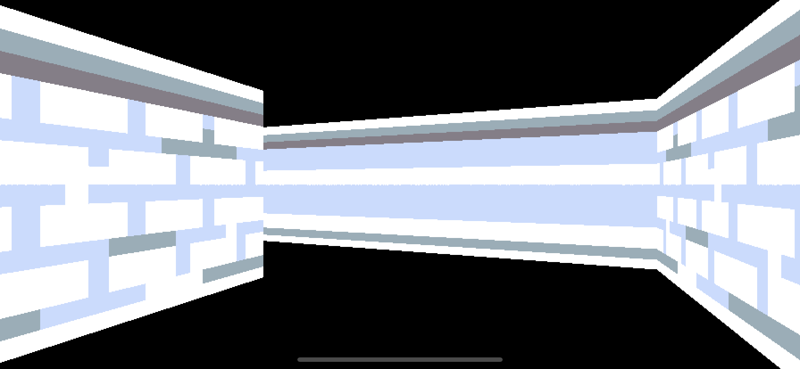
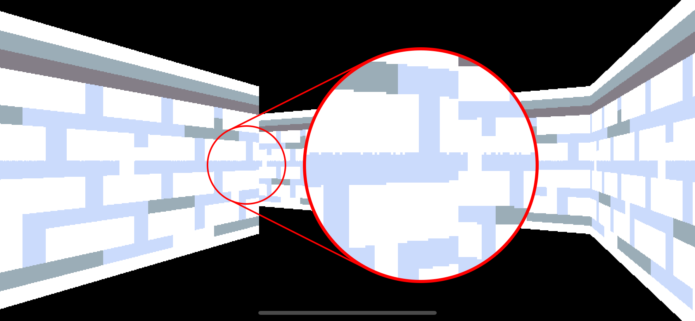
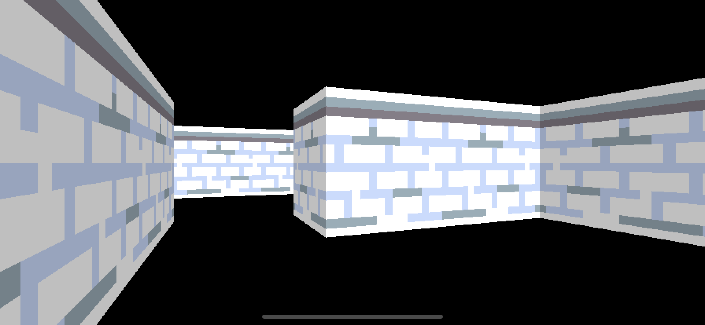
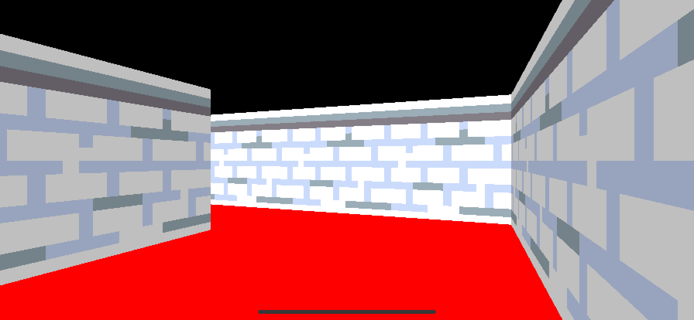
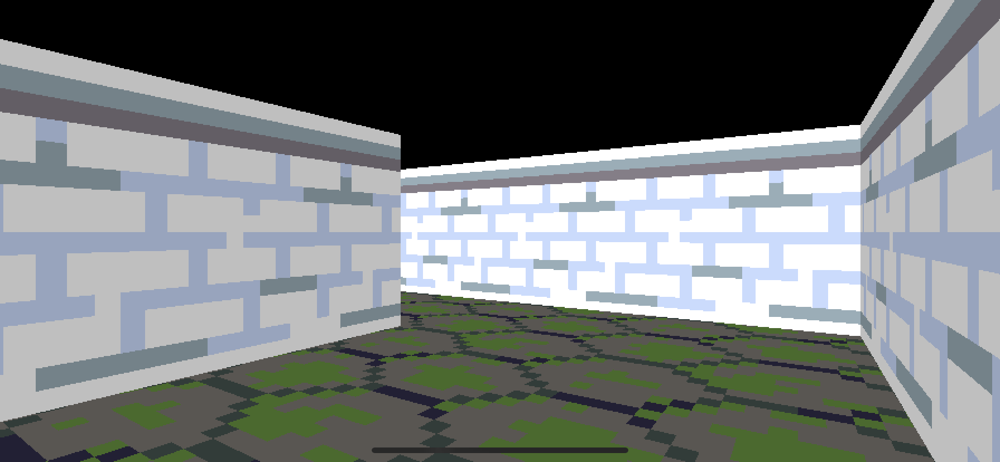
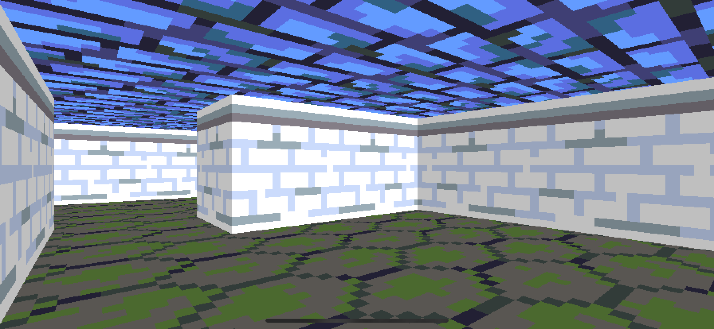
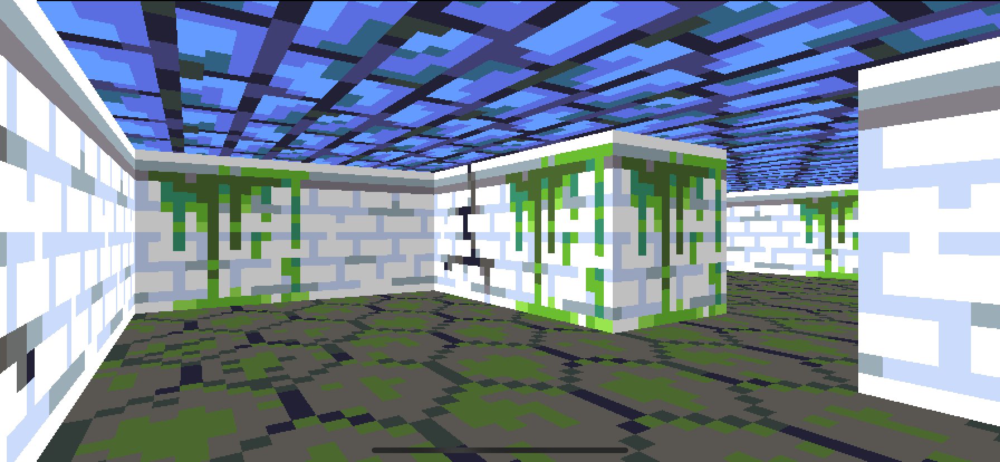
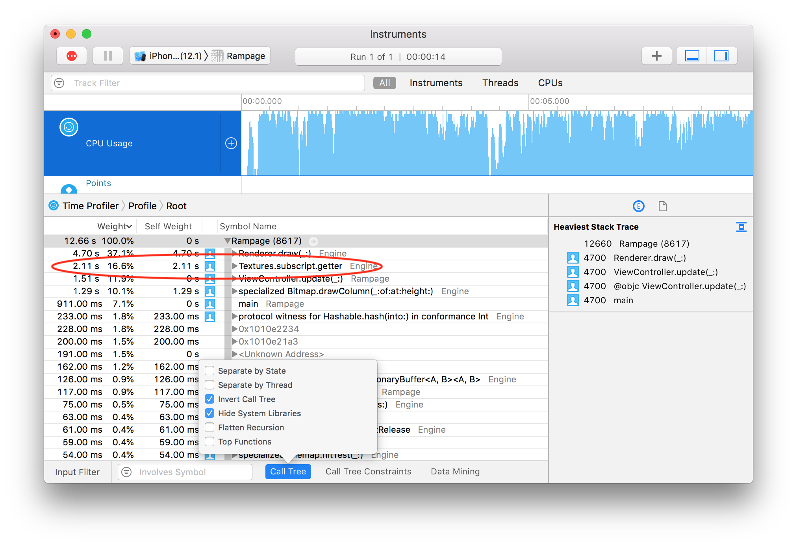
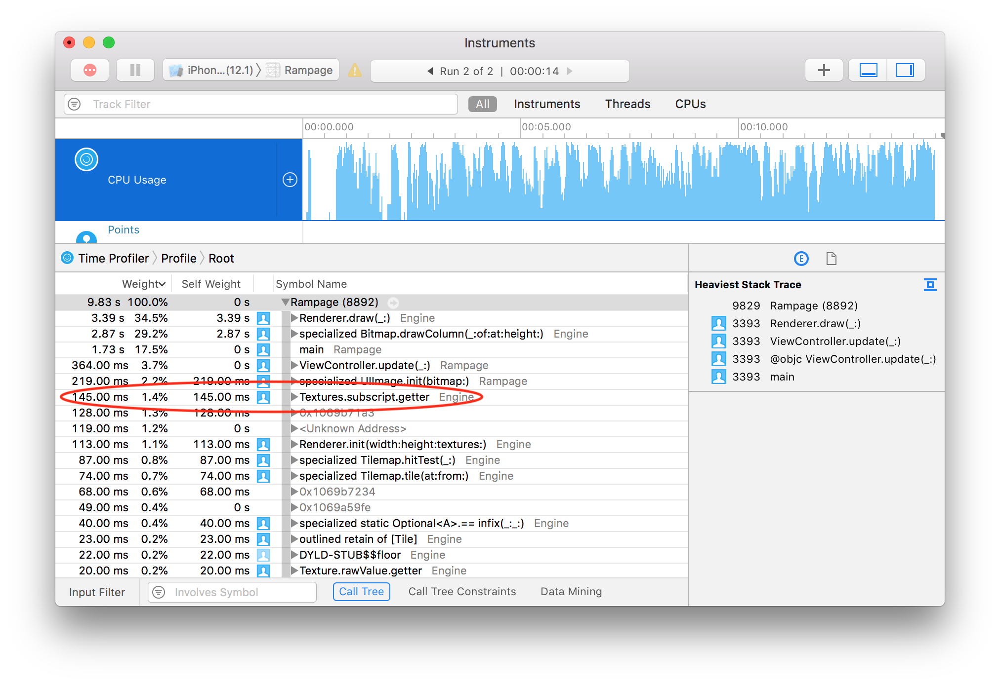

## Part 4: Texture Mapping

In [Part 3](Part3.md) we used ray casting to render our simple 2D maze in glorious 3D. The complete code from Part 3 can be found [here](https://github.com/nicklockwood/RetroRampage/archive/Part3.zip).

Walking around a 3D world of our own creation is pretty neat, but the novelty wears off pretty quick with only boring white walls to look at. Let's improve the decor a bit.

### Sweet Release

A quick note before we begin: Graphics code of the sort we are writing is extremely sensitive to compiler optimizations. You may find that the game is almost unplayably slow when running in *Debug* mode, but should be much smoother if you run in *Release* mode.

To enable Release mode, go to Edit Scheme > Run > Build Configuration (see below).


Note that when running in Release mode, debugging tools may not work as expected, so you may need to toggle back to Debug when diagnosing errors.

### Surface Detail

The traditional way to make walls more interesting in a 3D game is to use *texture mapping*. This is a technique where a 2D image is used to decorate a 3D surface, a bit like wallpaper. The term "texture" implies some sort of roughness, but the most common form of texture map is a *color* map, which only affects the color of the surface, not its shape<sup><a id="reference1"></a>[[1]](#footnote1)</sup>.

We'll need an image to use for the wall texture. This image should be square, and needs to wrap horizontally (i.e. the rightmost column of pixels should match up seamlessly with the leftmost column).

I'm going to use a 16x16 image because big pixels make it easier to see what's going on<sup><a id="reference2"></a>[[2]](#footnote2)</sup>, but you should feel free to use any size you like<sup><a id="reference3"></a>[[3]](#footnote3)</sup>. Drawing performance is mainly constrained by the resolution of the *output* bitmap, not the size of individual input textures.


You are welcome to use this image if you don't feel like drawing your own - you can find it [here](https://github.com/nicklockwood/RetroRampage/tree/Part4/Source/Rampage/Assets.xcassets), along with all other textures used in this tutorial.

We'll need some way to get the image into the game. Since the Engine module knows nothing about the filesystem, it makes sense for the platform layer to load the images and pass them into the engine. Although in theory we could make `Bitmap` conform to `Decodable` and load it directly using our own file format, iOS already has optimized mechanisms for handling images using XCAssets and `.car` files, and we shouldn't fight the host operating system.

In the main project, add your wall texture to `Assets.xcassets` and name it `wall` (all lower-case).

We're going to need more than one texture eventually, so rather than just passing in a single `Bitmap`, let's create a wrapper we can modify later once we better understand what our requirements are. Create a new file called `Textures.swift` in the Engine module with the following contents:

```swift
public enum Texture: String, CaseIterable {
    case wall
}

public struct Textures {
    private let textures: [Texture: Bitmap]
}

public extension Textures {
    init(loader: (String) -> Bitmap) {
        var textures = [Texture: Bitmap]()
        for texture in Texture.allCases {
            textures[texture] = loader(texture.rawValue)
        }
        self.init(textures: textures)
    }

    subscript(_ texture: Texture) -> Bitmap {
        return textures[texture]!
    }
}
```

The `Texture` enum is backed by a `String` and conforms to `CaseIterable`. This allows for a very elegant implementation of the `Textures` initializer, which requests bitmaps for textures automatically based on their case names.

The `Textures` struct is basically just a wrapper around a `Dictionary`, but because the initializer implementation makes it impossible to request an image that doesn't exist, the `subscript` can safely return a non-`Optional` value.

In `Renderer.swift` add a `textures` property and change the initializer to accept a `textures` parameter:

```swift
public struct Renderer {
    public private(set) var bitmap: Bitmap
    private let textures: Textures

    public init(width: Int, height: Int, textures: Textures) {
        self.bitmap = Bitmap(width: width, height: height, color: .black)
        self.textures = textures
    }
}
```

Images in XCAssets are typically loaded using `UIImage(named:)`. We already have code to convert a `Bitmap` to a `UIImage`, so let's add the *inverse* conversion. Open `UIImage+Bitmap.swift` and add the following code:

```swift
extension Bitmap {
    init?(image: UIImage) {
        guard let cgImage = image.cgImage else {
            return nil
        }

        let alphaInfo = CGImageAlphaInfo.premultipliedLast
        let bytesPerPixel = MemoryLayout<Color>.size
        let bytesPerRow = cgImage.width * bytesPerPixel

        var pixels = [Color](repeating: .clear, count: cgImage.width * cgImage.height)
        guard let context = CGContext(
            data: &pixels,
            width: cgImage.width,
            height: cgImage.height,
            bitsPerComponent: 8,
            bytesPerRow: bytesPerRow,
            space: CGColorSpaceCreateDeviceRGB(),
            bitmapInfo: alphaInfo.rawValue
        ) else {
            return nil
        }

        context.draw(cgImage, in: CGRect(origin: .zero, size: image.size))
        self.init(width: cgImage.width, pixels: pixels)
    }
}
```

This method initializes a `Bitmap` from a `UIImage`. I works by creating a new `CGContext` backed by an array of `Color` pixels, then drawing the `UIImage` into that context, thereby filling the `Color` array with the image contents.

In `ViewController.swift`, add the following free function at the top of the file<sup><a id="reference4"></a>[[4]](#footnote4)</sup>:

```swift
private func loadTextures() -> Textures {
    return Textures(loader: { name in
        Bitmap(image: UIImage(named: name)!)!
    })
}
```

Then add the following property to the `ViewController` class:

```swift
private let textures = loadTextures()
```

And finally, in the `update()` method change the line:

```swift
var renderer = Renderer(width: width, height: height)
```

to:

```swift
var renderer = Renderer(width: width, height: height, textures: textures)
```

Now that the wall texture is available to the engine, we actually have to use it to draw the walls. The way that texture mapping works is that for each pixel of the 3D surface shown on screen, we find the equivalent coordinate on the texture, and then draw that color.

This normally involves a lot of matrix math to convert between the two coordinate systems, but fortunately because our wall surfaces are squares that exactly match the texture dimensions, and are only rotated in one plane, the mapping in this case is fairly straightforward.

We currently draw the walls one column of pixels at a time, with the height of each column determined by its distance from the camera. We know the top and bottom of the wall match up with the top and bottom of the texture, so the only tricky part will be mapping from the X position of the column on screen to the X position of the column within the texture.


Again, the grid-based nature of the map really helps here. The `Tilemap.hitTest()` method provides the world coordinate at which each ray hits the wall. Because the walls are arranged on a 1x1 world-unit grid, the fractional part of the coordinate value represents how far along the wall the ray landed, in the range 0 - 1. We can take this value and multiply it by the texture width to get the correct X offset within the texture.

We'll need to replace the `drawLine()` call with a new method that copies a column of the wall texture to the output bitmap. Add the following code to `Bitmap.swift`:

```swift
public extension Bitmap {
    ...
    
    mutating func drawColumn(_ sourceX: Int, of source: Bitmap, at point: Vector, height: Double) {
        let start = Int(point.y), end = Int(point.y + height) + 1
        let stepY = Double(source.height) / height
        for y in max(0, start) ..< min(self.height, end) {
            let sourceY = (Double(y) - point.y) * stepY
            let sourceColor = source[sourceX, Int(sourceY)]
            self[Int(point.x), y] = sourceColor
        }
    }
}
```

This method is similar to `drawLine()`, but simpler because the line it draws is always vertical, so we are only stepping along the Y axis. The `sourceX` parameter is the X coordinate of the column of pixels within the source bitmap that we need to copy. The `point` parameter specifies the starting position in the destination bitmap to begin drawing, and `height` indicates the output height of the column of pixels to be drawn.

The code first computes the `start` and `end` pixel positions in the destination bitmap, then loops through them. Because the actual size of the source bitmap may be larger or smaller than the size at which it is being drawn, we need to calculate the Y position of each pixel in the source for the current output Y position in the destination - that's what the `stepY` value is for.

Now we need to update `Renderer.draw()` to use this method. Replace the lines:

```swift
let wallColor: Color
if end.x.rounded(.down) == end.x {
    wallColor = .white
} else {
    wallColor = .gray
}
bitmap.drawLine(
    from: Vector(x: Double(x), y: (Double(bitmap.height) - height) / 2),
    to: Vector(x: Double(x), y: (Double(bitmap.height) + height) / 2),
    color: wallColor
)
```

with:

```swift
let wallTexture = textures[.wall]
let wallX = end.x - end.x.rounded(.down)
let textureX = Int(wallX * Double(wallTexture.width))
let wallStart = Vector(x: Double(x), y: (Double(bitmap.height) - height) / 2)
bitmap.drawColumn(textureX, of: wallTexture, at: wallStart, height: height)
```

The first line takes the `end` position vector (the point where the ray intersects the wall) and extracts just the fractional part of the X component (`wallX`). This is then used to determine which column of the texture to draw (`textureX`). Try running the app:



Hmm... well that's *almost* right. The problem is that we're only using the X component of the wall position for the texture offset, but we need to use either the X *or* Y parts, depending on whether it's a vertical (North/South) or horizontal (West/East) wall.

We actually just deleted some code that checked if the wall was horizontal or vertical in order to select the correct wall color, so let's bring that back and use it to select either the X or Y component of the `end` position to use for the texture coordinate. Still in `Renderer.draw()`, replace the line:

```swift
let wallX = end.x - end.x.rounded(.down)
```

with:

```swift
let wallX: Double
if end.x.rounded(.down) == end.x {
    wallX = end.y - end.y.rounded(.down)
} else {
    wallX = end.x - end.x.rounded(.down)
}
```

Run the app again and you'll see that the smeared rear wall is now textured correctly. If you look *closely* however, you may notice a small glitch running horizontally along the middle row of pixels on the screen.



This glitch is caused by floating point rounding errors where the edge of the texture pixels are too close to the pixel boundary on screen. The computed texture coordinate is almost exactly on the boundary between two texture pixels, so it flips between the two as alternate columns are drawn.

A simple (if somewhat hack-y) solution is just to add a tiny offset to the rendering position so the values no longer clash. In `Renderer.draw()` replace the line:

```swift
let wallStart = Vector(x: Double(x), y: (Double(bitmap.height) - height) / 2)
```

with:

```swift
let wallStart = Vector(x: Double(x), y: (Double(bitmap.height) - height) / 2 + 0.001)
```

### Watch Your Tone

The walls look a lot better with textures applied, but we've lost the nice two-tone lighting effect.

Wolfenstein achieved this effect by using two sets of textures. The fixed 256-color palette meant it was no simple feat to adjust brightness programmatically. Darker versions of a given color didn't necessarily exist in the palette, and in those cases a suitable substitute would have to be chosen by hand by the texture artist.

Since we're working with 32-bit color, it's actually a lot simpler for us to darken a given image at runtime, but for now we'll just do as Wolfenstein did and create a second copy of the texture.

Add a second, darker copy of `wall` called `wall2` to XCAssets, and add a matching case to the `Texture` enum:

```swift
public enum Texture: String, CaseIterable {
    case wall, wall2
}
```

The same `if` statement we originally used to select the wall color (and then repurposed to help calculate the texture coordinate) can be used to select the correct wall texture. In `Renderer.draw()` replace the following code:

```swift
let wallTexture = textures[.wall]
let wallX: Double
if end.x.rounded(.down) == end.x {
    wallX = end.y - end.y.rounded(.down)
} else {
    wallX = end.x - end.x.rounded(.down)
}
```

with:

```swift
let wallTexture: Bitmap
let wallX: Double
if end.x.rounded(.down) == end.x {
    wallTexture = textures[.wall]
    wallX = end.y - end.y.rounded(.down)
} else {
    wallTexture = textures[.wall2]
    wallX = end.x - end.x.rounded(.down)
}
```

Run the app again and you'll see that the two-tone lighting is back, helping to make the world look more solid.



### The Floor in the Plan

That's the wallpaper sorted, but what about the floor and ceiling? You may be surprised to hear (if you haven't played it in the last 25 years) that Wolfenstein actually didn't bother with floor or ceiling textures, instead opting for a simple solid color.

The process for drawing floor and ceiling textures is more computationally expensive than for walls, requiring a depth calculation for every pixel rather than just one for each column. But while the machines of Wolfenstein's era may have struggled with it, it's not really a problem for a modern CPU.

Let's depart from strict adherence to the limitations of the Wolfenstein engine, and draw ourselves a textured floor.

To draw the floor we need to fill the column of pixels below each column of the wall up to the edge of the screen. Let's begin by just filling the floor with a solid color, one column at a time. In the `Renderer.draw()` method, just before `columnPosition += step`, add the following:

```swift
// Draw floor
let floorStart = Int(wallStart.y + height) + 1
for y in min(floorStart, bitmap.height) ..< bitmap.height {
    bitmap[x, y] = .red
}
```

The `floorStart` value is basically the same as the upper bound we used for the `drawColumn()` method - in other words the floor starts exactly where the wall ends. The `min()` function is needed because if the wall is too close to the player, `floorStart` would actually be below the bottom edge of the screen, resulting in an invalid range. Run the app and you should see a solid red floor.



Now that we know which pixels we are going to fill, we need a texture to fill them with. Go ahead and add two new texture called `floor` and `ceiling` to both the XCAssets and the `Texture` enum in `Textures.swift`. Like the walls, these textures should be square, but this time they will need to tile both horizontally *and* vertically to avoid ugly seams on the floor.

```swift
public enum Texture: String, CaseIterable {
    case wall, wall2
    case floor, ceiling
}
```

Because the pixels in each column of the floor are not all at the same distance from the camera, we cannot use the `drawColumn()` function we wrote earlier. We'll have to compute the correct color for each pixel individually.

When drawing the walls, we first computed the position of the wall in world units, and then used the [perspective projection equation](https://en.wikipedia.org/wiki/3D_projection#Weak_perspective_projection) to transform that into screen coordinates. This time we're going to go the *other way* and derive the world coordinate from the screen position.

The map position at `floorStart` is the same distance away as the wall itself - in other words it will be `wallDistance` world units from the camera. Each successive pixel we step over in the loop moves the position closer to the camera. The distance of that position from the camera can be derived by applying the perspective equation in reverse.

The first step is to convert the Y position (in pixels) to a normalized position relative to the view plane. We do that by dividing by the output bitmap height:

```swift
let normalizedY = Double(y) / Double(bitmap.height)
```

That gives us a value for `normalizedY` where zero is at the top of the view plane and one is at the bottom. The vanishing point (the point at which the floor or ceiling would be infinitely away) is in the middle of the screen, so we actually want the zero value of `normalizedY` to be the *center* of the screen, not the top. We can achieve that by multiplying the value by two and then subtracting one:

```swift
let normalizedY = (Double(y) / Double(bitmap.height)) * 2 - 1
```

From the normalized Y value, we can use the inverse perspective equation to derive the perpendicular distance of that pixel from the camera:

```swift
let perpendicular = wallHeight * focalLength / normalizedY
```

Next, by dividing by the `distanceRatio` we calculated earlier we can determine the actual distance, and from that we can compute the map position:

```swift
let distance = perpendicular * distanceRatio
let mapPosition = ray.origin + ray.direction * distance
```

Because the tiles are on a 1x1 grid, the integer parts of the `mapPosition` X and Y components give us the tile coordinate, and the fractional parts give us the precise position within the tile itself, which we can use to derive the texture coordinate:

```swift
let tileX = mapPosition.x.rounded(.down), tileY = mapPosition.y.rounded(.down)
let textureX = Int((mapPosition.x - tileX) * Double(floorTexture.width))
let textureY = Int((mapPosition.y - tileY) * Double(floorTexture.height))
```

That's everything we need to texture the floor. In `Renderer.draw()` replace the following lines:

```swift
// Draw floor
let floorStart = Int(wallStart.y + height) + 1
for y in min(floorStart, bitmap.height) ..< bitmap.height {
    bitmap[x, y] = .red
}
```

with:

```swift
// Draw floor
let floorTexture = textures[.floor]
let floorStart = Int(wallStart.y + height) + 1
for y in min(floorStart, bitmap.height) ..< bitmap.height {
    let normalizedY = (Double(y) / Double(bitmap.height)) * 2 - 1
    let perpendicular = wallHeight * focalLength / normalizedY
    let distance = perpendicular * distanceRatio
    let mapPosition = ray.origin + ray.direction * distance
    let tileX = mapPosition.x.rounded(.down), tileY = mapPosition.y.rounded(.down)
    let textureX = Int((mapPosition.x - tileX) * Double(floorTexture.width))
    let textureY = Int((mapPosition.y - tileY) * Double(floorTexture.height))
    bitmap[x, y] = floorTexture[textureX, textureY]
}
```

Run the game and you should see that the floor is now textured.



To draw the ceiling we could duplicate this code, with a slight change to the `normalizedY` calculation. But there's actually an even simpler way - because the ceiling's coordinates are a mirror of the floor's, we can draw them both with the same loop by just inverting the output Y coordinate. Replace the lines:

```swift
// Draw floor
let floorTexture = textures[.floor]
```

with:

```swift
// Draw floor and ceiling
let floorTexture = textures[.floor], ceilingTexture = textures[.ceiling]
```

And then just below the line that sets the floor pixel color:

```swift
bitmap[x, y] = floorTexture[textureX, textureY]
```

add the following line to fill the equivalent ceiling pixel:

```swift
bitmap[x, bitmap.height - y] = ceilingTexture[textureX, textureY]
```

Run the game again and you'll see that the textured floor now has a matching ceiling.



### Not Normal

We cheated a little by re-using the floor texture coordinates for the ceiling - not because they don't match up (they do) - but because the ceiling texture isn't *necessarily* the same size as the floor texture. If the floor and ceiling textures had different resolutions then this logic wouldn't work.

We could solve this by duplicating the `textureX` and `textureY` variables and calculating them separately for each texture, but that's nasty. What we really want is to be able to look up texture pixels using *normalized* coordinates, so we don't have to worry about their actual pixel dimensions.

Let's add a way to do that. In `Bitmap.swift` add the following code just below the existing `subscript`:

```swift
subscript(normalized x: Double, y: Double) -> Color {
    return self[Int(x * Double(width)), Int(y * Double(height))]
}
```

Now, back in the `Renderer.draw()` method, a little way below the `// Draw floor and ceiling` comment, replace the lines:

```swift
let textureX = Int((mapPosition.x - tileX) * Double(floorTexture.width))
let textureY = Int((mapPosition.y - tileY) * Double(floorTexture.height))
bitmap[x, y] = floorTexture[textureX, textureY]
bitmap[x, bitmap.height - y] = ceilingTexture[textureX, textureY]
```

with:

```swift
let textureX = mapPosition.x - tileX, textureY = mapPosition.y - tileY
bitmap[x, y] = floorTexture[normalized: textureX, textureY]
bitmap[x, bitmap.height - y] = ceilingTexture[normalized: textureX, textureY]
```

The new code is more concise, but more importantly it's *correct*, regardless of the relative texture resolutions.

### Variety Show

Even with textures, the world looks a bit monotonous when every wall is the same. Currently the wall and floor textures are always the same because they're hard-coded in the renderer, but we really want these to be specified by the *map*.

We'll start by adding two new wall types and a new floor type to the XCAssets file. For the walls, we need two textures for each new type (light and dark).


In `Textures.swift` extend the `Texture` enum with these five additional cases:

```swift
public enum Texture: String, CaseIterable {
    case wall, wall2
    case crackwall, crackwall2
    case slimewall, slimewall2
    case floor
    case crackfloor
    case ceiling
}
```

Note that the order and grouping of the cases in the enum isn't important, as the values are keyed by name rather than index.

Next, we need to extend the `Tile` enum with new cases as well:

```swift
public enum Tile: Int, Decodable {
    case floor
    case wall
    case crackwall
    case slimewall
    case crackfloor
}
```

In this case the order *is* important. Because we are decoding these values by index from the `Map.json` file, if we change the order then it will break the map. If you'd prefer to have the freedom to group them logically, you can preserve compatibility with the JSON by setting the indices explicitly:

```swift
public enum Tile: Int, Decodable {
    // Floors
    case floor = 0
    case crackfloor = 4
    
    // Walls
    case wall = 1
    case crackwall = 2
    case slimewall = 3
} 
```

Now that we have more wall types, we'll need to update the `Tile.isWall` helper property we wrote earlier. Add the extra cases as follows:

```swift
var isWall: Bool {
    switch self {
    case .wall, .crackwall, .slimewall:
        return true
    case .floor, .crackfloor:
        return false
    }
}
```

Since there are two textures for each wall tile (and for the floor tiles too, if you count the ceiling texture) we'll need some form of mapping between them. For now we'll just hard-code the textures for each case using a `switch`. Add a new computed property to `Tile` as follows::

```swift
public extension Tile {
    ...
    
    var textures: [Texture] {
        switch self {
        case .floor:
            return [.floor, .ceiling]
        case .crackfloor:
            return [.crackfloor, .ceiling]
        case .wall:
            return [.wall, .wall2]
        case .crackwall:
            return [.crackwall, .crackwall2]
        case .slimewall:
            return [.slimewall, .slimewall2]
        }
    }
}
```

The map layout itself is specified in the `Map.json` file in the main project. Edit the `tiles` array in the JSON to include some of our new wall and floor tiles (the exact layout doesn't matter for the tutorial, so feel free to be creative):

```swift
"tiles": [
    1, 3, 1, 1, 3, 1, 1, 1,
    1, 0, 0, 2, 0, 0, 0, 1,
    1, 4, 0, 3, 4, 0, 0, 3,
    2, 0, 0, 0, 0, 0, 4, 3,
    1, 4, 0, 1, 1, 1, 0, 1,
    1, 0, 4, 2, 0, 0, 0, 1,
    1, 0, 0, 1, 0, 4, 4, 1,
    1, 3, 3, 1, 1, 3, 1, 1
],
```

That's all of the updates to the game model - now we just need to update the renderer to use the textures specified by the `Tilemap` instead of hard-coded values.

We'll start with the walls. In order to select the correct texture, we first need to work out which wall we hit. You may recall that in Part 3 we added a method `tile(at:from:)` to `Tilemap` that was used to determine which tile a given ray was hitting given a hit position and direction. We can call that method again with the output of `hitTest()` to tell us which wall tile we hit, and from that we can select the correct texture.

In `Renderer.draw()`, a few lines below the `// Draw wall` comment, replace the lines:

```swift
if end.x.rounded(.down) == end.x {
    wallTexture = textures[.wall]
    wallX = end.y - end.y.rounded(.down)
} else {
    wallTexture = textures[.wall2]
    wallX = end.x - end.x.rounded(.down)
}
```

with:

```swift
let tile = world.map.tile(at: end, from: ray.direction)
if end.x.rounded(.down) == end.x {
    wallTexture = textures[tile.textures[0]]
    wallX = end.y - end.y.rounded(.down)
} else {
    wallTexture = textures[tile.textures[1]]
    wallX = end.x - end.x.rounded(.down)
}
```

We'll use a similar approach for the floor and ceiling. We can't look up the textures in advance anymore, so delete the following line from just below the `// Draw floor and ceiling` comment:

```swift
let floorTexture = textures[.floor], ceilingTexture = textures[.ceiling]
```

Now we'll use the `wallX` and `wallY` values we already computed to look up the tile, which will give us the textures. Still in the `// Draw floor and ceiling` section, find the line:

```swift
let tileX = mapPosition.x.rounded(.down), tileY = mapPosition.y.rounded(.down)
```

then insert the following code just below it:

```swift
let tile = world.map[Int(tileX), Int(tileY)]
let floorTexture = textures[tile.textures[0]]
let ceilingTexture = textures[tile.textures[1]]
```

And that should do it! Run the app again to see the new wall and floor tiles.



### Be Wise, Optimize

You may notice the frame rate dropping a bit as you move around, even when running in release mode. 

We've mostly avoided talking about optimization until now. It's generally a bad idea to optimize the code before you've finished implementing all the functionality, because optimized code can be harder to modify<sup><a id="reference5"></a>[[5]](#footnote5)</sup>.

In this case however, the performance *just* took an unexpected nose dive, which tells us that we probably did something dumb. Now is the best time to figure out what that might be, before we pile on more code and lose the context.

You may already have an intuition what the problem is, but it's a good idea to verify your assumptions before you start performance tuning. Open up the *Time Profiler* tool in Instruments, and run the game through it (ideally this should be done on a device, but for major issues the Simulator will give a reasonable picture of what's happening as well.

You should see something like the screenshot below. Pay close attention to the `Call Tree` settings - inverting the call tree and hiding system libraries makes the output easer to interpret.



The top function here is what we'd expect - the game spends most of its time inside the `Renderer.draw()` method. The second line item is a bit of a surprise though - `Textures.subscript.getter`. The most expensive single call inside `draw()` is not anything to do with vector math, or writing or reading pixels from a bitmap - it's just looking up the bitmaps for the textures.

It doesn't make a lot of sense that this would be an expensive operation. We aren't doing any loading or decoding - we loaded all the bitmaps for our textures in advance, and stored them in a `Dictionary`, keyed by the texture name. A hash lookup from a dictionary in Swift is by no means an expensive operation, so we'd have to be calling it *a lot* for it to dominate the trace.

*And it seems that we are.*

When drawing the walls, we have to do a texture lookup once for each ray, which is not too bad. Previously we were doing the same for the floor and ceiling textures (which never changed), but now that we are getting the texture from the map tile, we are looking it up again for *every single pixel* of the visible floor surface.

Most of the time, the texture doesn't change between consecutive pixels, so we shouldn't have to look it up again, we can just cache the most recently used texture and use it again. The problem (as always) with caching is knowing when to expire the cache.

As we draw the floor (and ceiling), we need to fetch a new texture every time the tile type changes, but *only* when it changes. The `Tile` type is just an `enum` backed by an `Int`, so it's very cheap to compare. Let's use the current `Tile` as a cache key, and re-fetch the textures whenever it changes.

When you hear the word "cache", you might be thinking of something like a dictionary of `Tile` to `Bitmap`, but remember that the objective here was to *avoid* the cost of a hash lookup. We only need to store a single cache entry (the last pair of texture bitmaps we used), so let's just use a few local variables outside the floor-drawing loop.

In `Renderer.draw()` just below the comment `// Draw floor and ceiling`, add the following lines:

```swift
var floorTile: Tile!
var floorTexture, ceilingTexture: Bitmap!
```

That's our cache storage. Next, replace the lines:

```swift
let floorTexture = textures[tile.textures[0]]
let ceilingTexture = textures[tile.textures[1]]
``` 

with:

```swift
if tile != floorTile {
    floorTexture = textures[tile.textures[0]]
    ceilingTexture = textures[tile.textures[1]]
    floorTile = tile
}
```

And that's the cache implementation. If the tile has changed since the last loop iteration, we fetch the new floor and ceiling textures and update the `floorTile` value used as the cache key. If it hasn't changed, we do nothing.

Run the game again and you should see that the frame drops have been fixed. If you compare the new Time Profiler trace, you'll also see that `Textures.subscript.getter` has been pushed way down the list and now represents only a small percentage of the total frame time. 



That's it for part 4. In this part we...

* Added wall, floor and ceiling textures
* Added texture variants, configurable by the map JSON
* Encountered and fixed our first performance blip

In Part 5 (TBD) we'll see about adding some other maze inhabitants to keep the player company.

<hr>

<a id="footnote1"></a>[[1]](#reference1) There are other types of texture map, such as [displacement maps](https://en.wikipedia.org/wiki/Displacement_mapping) that actually *can* affect the surface geometry, but such textures weren't seen in games until around 2005, coinciding with the mainstream availability of programmable GPUs capable of running complex shaders.

<a id="footnote2"></a>[[2]](#reference2) OK, it's also because I'm not much of an artist and fewer pixels are easier to draw.

<a id="footnote3"></a>[[3]](#reference3) Wolfenstein used 64x64 images for the wall textures, in case you were wondering. Doom used 128x128.

<a id="footnote4"></a>[[4]](#reference4) As with the `loadMap()` function, we haven't bothered with error handling in `loadTextures()`. An error here would be fatal anyway, and it's better to crash as early as possible.

<a id="footnote5"></a>[[5]](#reference5) As Kent Beck famously said, *"Make it work, make it right, make it fast."* (in that order).
